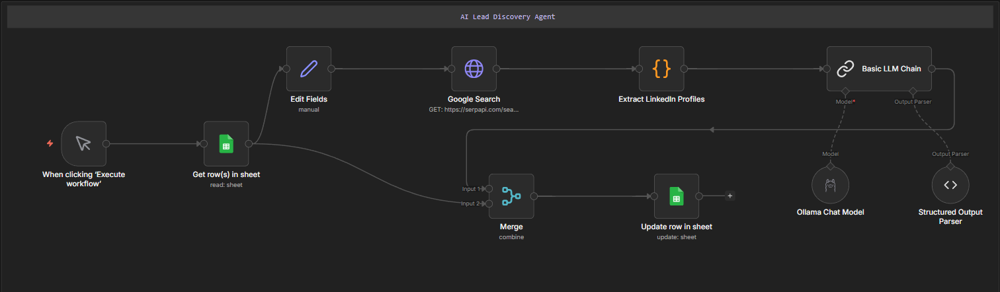

# AI Lead Discovery Agent (n8n + LLM)



An AI-powered Lead Discovery Agent built using n8n, SerpAPI, and a local LLM (Ollama). The system automatically discovers executive contacts such as CEOs or key decision makers from companies and stores the results in Google Sheets.

This workflow removes the need for manual prospect research by using an AI model to analyze LinkedIn search results and identify the most relevant executive profile.

---

## Overview

The AI Lead Discovery Agent automates the process of finding decision makers for companies. Given a list of company names, the workflow automatically:

1. Searches Google for LinkedIn profiles
2. Extracts potential executive profiles
3. Uses an LLM to select the most relevant CEO or executive
4. Saves the result back to Google Sheets

This system can be used for sales prospecting, lead generation, and business intelligence.

---

## Workflow Logic

The automation follows these steps.

### 1. Manual Trigger
The workflow starts when the user clicks "Execute Workflow" in n8n.

### 2. Read Companies from Google Sheets
The system reads company names from a Google Sheets dataset.

### 3. Generate Search Query
A search query is automatically generated:

```
CEO of {Company Name} LinkedIn site:linkedin.com/in
```

This ensures Google returns LinkedIn executive profiles.

### 4. Google Search using SerpAPI
The workflow sends a request to SerpAPI to retrieve Google search results.

### 5. Extract LinkedIn Profiles
A JavaScript code node filters the search results and extracts LinkedIn profile links.

### 6. AI Decision Making
The extracted profiles are passed to a local LLM through Ollama. The model analyzes the profiles and selects the best matching CEO or executive.

### 7. Structured Output
The LLM returns structured JSON data such as:

```json
{
  "person_name": "John Doe",
  "role": "CEO",
  "linkedin_url": "https://www.linkedin.com/in/..."
}
```

### 8. Update Google Sheet
The workflow updates the Google Sheet with the discovered lead information, including:

- Person Name
- Role
- LinkedIn URL
- Status

---

## Features

- Automated lead discovery
- Google search integration using SerpAPI
- LinkedIn profile extraction
- AI-based executive identification
- Structured output parsing
- Automatic updates to Google Sheets
- End-to-end workflow automation using n8n

---

## Tech Stack

| Technology | Purpose |
|------------|--------|
| n8n | Workflow automation |
| SerpAPI | Google search API |
| Ollama | Local LLM inference |
| Phi-3 Model | Profile analysis and selection |
| Google Sheets | Lead storage |
| JavaScript | Data extraction and processing |

---

## Example Output

| Company Name | Person Name | Role | LinkedIn URL | Status |
|--------------|-------------|------|--------------|--------|
| OpenAI | Sam Altman | CEO | linkedin.com/in/... | Found |
| Tesla | Elon Musk | CEO | linkedin.com/in/... | Found |

---

## Use Cases

This workflow can be used for:

- B2B sales prospecting
- Lead generation
- Startup research
- Market intelligence
- Automated outreach preparation

---

## How to Use

1. Install n8n locally or using Docker.
2. Import the `workflow.json` file into n8n.
3. Configure credentials:
   - Google Sheets API
   - SerpAPI
   - Ollama
4. Prepare a Google Sheet with at least the following columns:

```
Company Name
row_number
```

5. Execute the workflow to begin discovering leads.

---

## Future Improvements

- Automatic email discovery
- Integration with Apollo or Hunter APIs
- Automated cold outreach workflows
- AI-based lead scoring
- CRM integration

---

## Author

Pratik Nayak  
MCA Student | Automation and AI Enthusiast

Focused on building automation systems and AI agents that reduce manual effort and improve operational efficiency.
